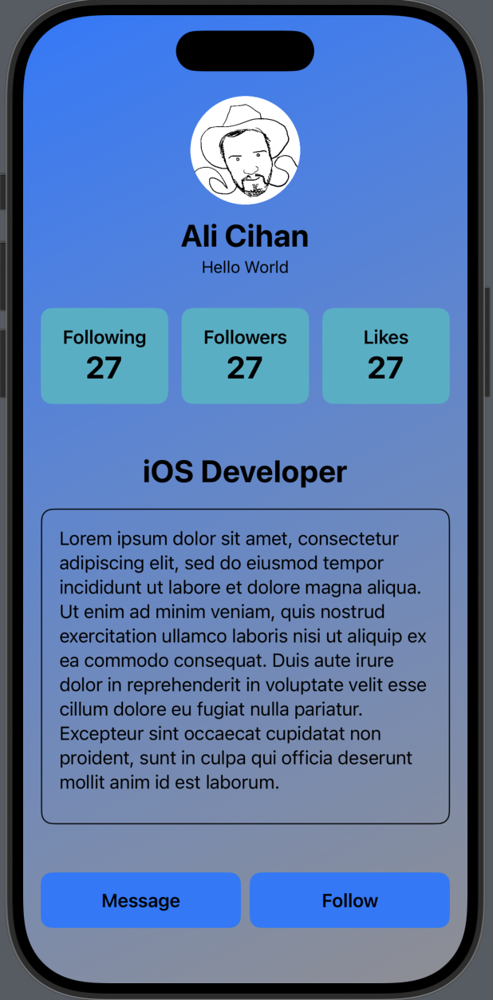

# User Profile

A simple SwiftUI demo app that displays a user profile card with an image, name, description, statistics, "About Me" section, and action buttons.

## Features

- **User Profile Header**: Circular user image, name, and short description.  
- **Info Section**: Following, Followers, and Likes counters in styled cards.  
- **About Me Section**: User’s title and scrollable biography text.  
- **Action Buttons**: Custom "Message" and "Follow" buttons.  
- **Modern UI**: Gradient background, rounded cards, and reusable components.

## Screenshots

